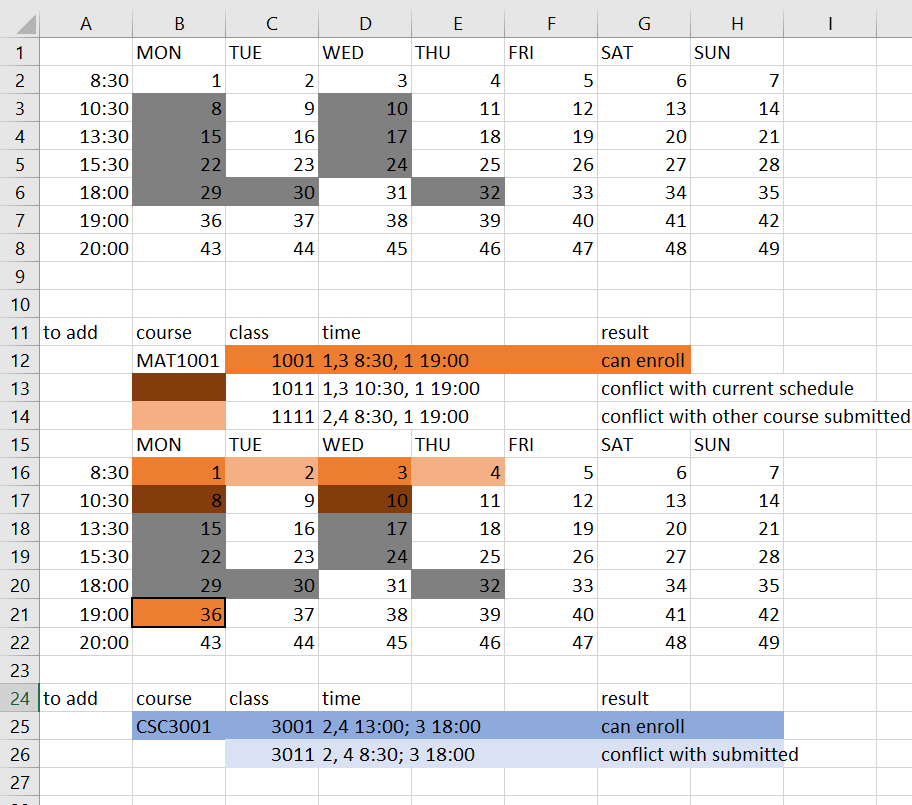

# 1127 功能：学生常规选课

- 更新者：staff

## 函数

1. `class_validation()`
2. `class_enroll()`

### class_validation()

- 输入：长度不超过6的short array
- 返回：int。
    - 0：有效的课程表。ui读到0就允许进入下一步，确认入选。class_enroll()
    - 年级限制
    - 先修不满足
    - 与已经有的课程有时间冲突，或者输入的课程互相之间有时间冲突
    - 输入当中有已经修过的课程
    - 输入当中有两门一样的课程

### class_enroll()

- 把学生加到课程temp_grade文件的最后；作业设为未完成
- 把课程加入学生档案中，并且更新学生对象。（参考教授claim_class的写法）

## 选课流程

1. validation
2. 通过之后，enroll

## 测试 studentTest.cpp, test_validation()

- 学生1230002当前课程表：
```text
        MON     TUE     WED     THU     FRI     SAT     SUN
8:30
10:30   STA2001         STA2001
13:30   CSC3002         CSC3002
15:30   CSC3100         CSC3100
18:00   CSC3002 CSC3100         STA2001
19:00
20:00
```
- 期望加入的课程的时间：
  - 以下展示的为成功方案中的课程的时间。班级分别为1001, 3001
```text
        MON     TUE     WED     THU     FRI     SAT     SUN
8:30    MAT1001         MAT1001
10:30
13:30           CSC3001         CSC3001
15:30
18:00                   CSC3001
19:00   MAT1001
20:00
```
- 学生成绩单：
```text
10
CSC4210 3.000000
CSC4210 3.000000
CSC4210 3.000000
CSC4210 3.000000
CSC4210 3.000000
MAT2041 3.700000
MAT2041 3.700000
MAT2041 3.700000
MAT2041 3.700000
MAT2041 3.700000
30.000000 33.500000 1.116667
```

- 期望结果：
```shell
  Trial 0, expected outcome 0, actual outcome 0
  Trial 0, expected outcome 1, actual outcome 0
  Trial 2.1, expected outcome 2, actual outcome 2
  Trial 2.2, expected outcome 2, actual outcome 0
  Trial 4, expected outcome -1002, actual outcome -1002
  Trial 5, expected outcome 5, actual outcome 5
  Trial 6, expected outcome 6, actual outcome 6
```

- trial 0, 5, 6 设计如下：
